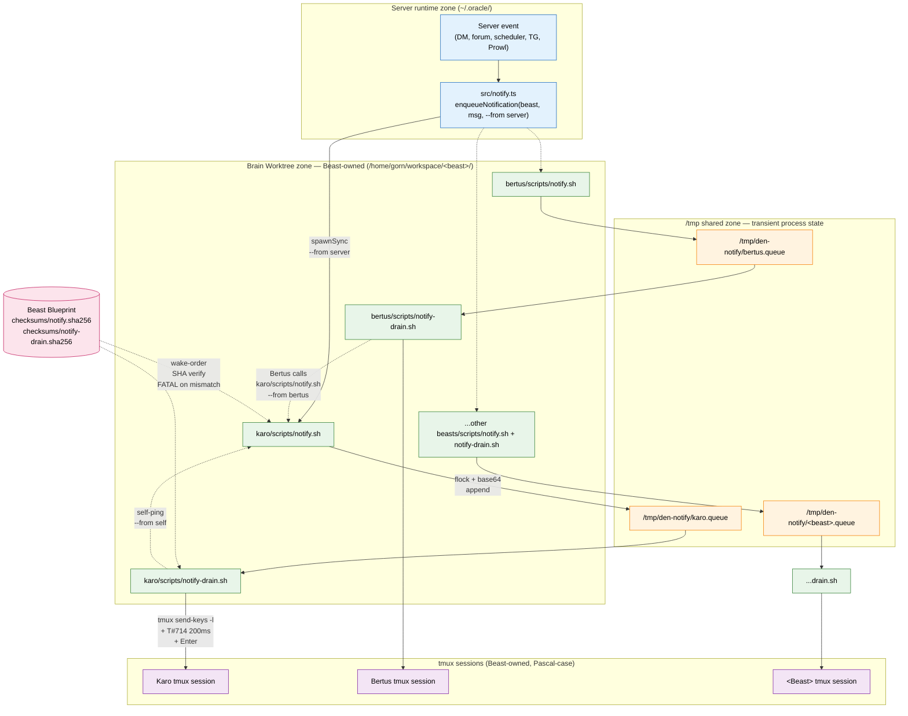

# Spec — Per-Beast notify-drain + notify (Sovereignty + Offline Resilience)

**Author**: Karo
**Status**: Draft → Review
**Version**: v4 (2026-04-30 ~14:00 BKK — direction-correction. v3 incorrectly DELETED notify.sh; v4 inverts: notify.sh MOVES to Beast Blueprint as beast-owned producer, server gets thin adaptor that invokes beast's notify.sh. Both ends of the notification stack now beast-sovereign. Direction locked with Gorn 2026-04-30 ~12:15 BKK Discord + 13:55 BKK TG.)
v3 was 2026-04-30 ~11:15 BKK (incorrect Option B — TypeScript queue-write replacing notify.sh).
v2 was 2026-04-27 ~13:00 BKK (pen-cluster fold).
v1 was 2026-04-27 12:50 BKK initial draft.
**Authored**: 2026-04-27 12:50 BKK
**Origin**: Gorn-direction 2026-04-27 12:41 BKK Discord — *"I think we should add the notify drain in beast's blueprint and let it sits in beast's brain"* + *"Then in CLAUDE.md tell beasts to start their notify-drain.sh as well"*. Refined 2026-04-30 12:18 BKK Discord — *"beasts need to have their notify.sh so beasts are not dependent on denbook for receiving notifications"* (extended scope to producer-side). Architecturally aligned with: Den-Architecture lean toward Beast-sovereignty, Decree #66 Req 6 incident-response continuity, Beast Blueprint propagation pattern.

---

## Problem

Current notification stack lives **inside the denbook server process**:

- **Producer**: `enqueueNotification()` in `src/notify.ts` shells out to `denbook/scripts/notify.sh` via `Bun.spawnSync`. Server-owned script.
- **Consumer**: `runDrainCycle()` in `src/server.ts` polls `/tmp/den-notify/<beast>.queue`, drains via tmux send-keys.

**Single point of failure** on both axes:

- **Server crash / restart / OOM kill / deploy** → ALL Beast notifications stop until server recovery. Queue files at `/tmp/den-notify/<beast>.queue` accumulate but nothing delivers them to tmux. AND no new notifications can be enqueued by server-side events.
- **All-or-nothing failure mode** — one drain process serves the whole pack; drain bug or server bug = pack-wide notification outage.
- **No beast-to-beast direct path** — Bertus has security alert for Karo, currently must route through server's `enqueueNotification()`. If server is down (the exact moment fast pack coordination matters most), pack-internal comms is dead.
- **Decree #66 Req 6 incident-response continuity gap** — central server is the bottleneck for both produce and consume sides.

The standalone `denbook/scripts/notify-drain.sh` script exists on disk but is **superseded** (per 2026-03-30 handoff). No per-Beast drain processes currently running anywhere on this machine (verified via `pgrep -af drain` returning empty).

## Goal

**Both ends of the notification stack become Beast-owned**:

1. **Consumer (drain)**: Move drain from server-process into **per-Beast brain worktree** as a Beast-managed background process. Each Beast owns and runs their own drain, scoped to their own queue + tmux session. Failure isolation = per-Beast, not pack-wide. (Unchanged from v2.)

2. **Producer (notify)** *(v4 correction)*: Move `notify.sh` from `denbook/scripts/` to `<beast>/scripts/` (Beast Blueprint). Each Beast owns their notify.sh. Server gets a thin **adaptor** that invokes the target Beast's notify.sh. Beast-to-beast direct invocation allowed (no server dependency on the wire).

Combined with the Decree #59 boundary + bearer-derive auth (Spec #51, Spec #52), this completes the Beast-sovereignty pattern at the notification layer **on both axes**.

## Design

### Architecture diagram



**Diagram reading**:
- **Brain Worktree zone (green)**: each beast owns BOTH `notify.sh` (producer) and `notify-drain.sh` (consumer) in their own brain. Sovereignty quartet completion.
- **/tmp shared zone (orange)**: queue files at well-known paths. Mode 0700 dir, mode 0600 files. Transient state per the three-zone separation.
- **Server runtime zone (blue)**: server event sources flow into thin adaptor (`enqueueNotification`) that spawns the target beast's notify.sh.
- **tmux sessions (purple)**: drain delivers via `tmux send-keys -l` + T#714 200ms race-fix + Enter.
- **Beast Blueprint (pink, hexagonal)**: wake-order SHA-verify gate on both scripts. FATAL on mismatch.

**Three producer paths converging at the queue** (key sovereignty insight):
1. **Server-originated** (solid arrow): server event → adaptor → `<beast>/scripts/notify.sh`
2. **Beast-to-beast direct** (dotted): one beast invokes another's notify.sh directly. No server on the call path. This is the offline-resilience unlock — pack-internal coordination continues even if denbook server is down.
3. **Self-ping** (dotted): beast invokes own notify.sh from in-process scripts. Useful for self-reminders, scheduled self-pokes.

All three paths produce the same queue-line format (timestamp + sender + message). Drain reads the queue uniformly — producer diversity, consumer unity. Right topology.

### Producer: `notify.sh` in Beast Blueprint (v4 — correct shape)

**Location**: `/home/gorn/workspace/<beast>/scripts/notify.sh` (Beast Blueprint propagation).

**Script content** (shared across all Beasts, beast-name derived from script location):

```bash
#!/bin/bash
# Den notification queue — enqueue a message for THIS beast's queue
# Usage: notify.sh <message> [--from <sender>]
# Beast-owned. Per Spec #54 sovereignty pattern.

set -euo pipefail

# Derive THIS beast's name from script location: <beast>/scripts/notify.sh
SELF_BEAST="$(basename "$(dirname "$(dirname "$(readlink -f "$0")")")")"

MESSAGE=""
SENDER="server"  # default for backward compat with legacy server-adaptor calls

while [ $# -gt 0 ]; do
  case "$1" in
    --from) SENDER="$2"; shift 2 ;;
    *) MESSAGE="$1"; shift ;;
  esac
done

if [ -z "$MESSAGE" ]; then
  echo "Usage: notify.sh <message> [--from <sender>]" >&2
  exit 1
fi

# Validate sender — alphanumeric only, length <= 32 (anti-injection)
if ! [[ "$SENDER" =~ ^[a-zA-Z0-9_-]{1,32}$ ]]; then
  echo "FATAL: invalid sender '$SENDER'" >&2
  exit 2
fi

QUEUE_DIR="/tmp/den-notify"
QUEUE_FILE="$QUEUE_DIR/$SELF_BEAST.queue"
LOCK_FILE="$QUEUE_DIR/$SELF_BEAST.lock"

mkdir -p "$QUEUE_DIR"
chmod 700 "$QUEUE_DIR" 2>/dev/null || true
umask 0077

# Format: [YYYY-MM-DD HH:MM:SS UTC+7] [from <sender>] <message>
TS=$(TZ=Asia/Bangkok date '+[%Y-%m-%d %H:%M:%S UTC+7]')
STAMPED="$TS [from $SENDER] $MESSAGE"

# Base64 encode to safely handle newlines, quotes, special chars
ENCODED=$(echo -n "$STAMPED" | base64 -w 0)

# Atomic append with flock
flock "$LOCK_FILE" bash -c "echo '$ENCODED' >> '$QUEUE_FILE'"
```

**Key behaviors**:
- **Beast-derived self-target**: script writes to `/tmp/den-notify/<self>.queue` where `<self>` is derived from the script's own location. A beast cannot accidentally write to another beast's queue by calling its own notify.sh — you must call the TARGET beast's notify.sh.
- **Timestamp stamping**: moved INTO the script (was in `src/notify.ts` `formatUtc7Timestamp()`). All callers now get consistent stamping regardless of entry-point.
- **Sender attribution**: `--from <sender>` arg, honor-system. Default `--from server` preserves backward compat during migration. Sender format injected as `[from <sender>]` after timestamp, before message body.
- **Sender validation**: alphanumeric + dash/underscore, length ≤ 32. Anti-injection at script-arg layer (closes the same shape Bertus flagged on the v3 TS validation).
- **Permissions discipline**: `mkdir -p` enforces dir mode 700, `umask 0077` enforces queue file mode 600.

### Producer: Server adaptor (v4)

**Location**: `denbook/src/notify.ts` (existing file, refactored).

```ts
import path from 'path';

const WORKSPACE_ROOT = '/home/gorn/workspace';

export interface EnqueueOpts {
  /** Sender attribution. Defaults to 'server'. */
  from?: string;
  /** Event time. Currently unused (timestamp stamped by notify.sh on enqueue).
   *  Reserved for future sentAt-vs-enqueueAt distinction. */
  sentAt?: Date;
}

/**
 * Enqueue a notification for a Beast by invoking the target Beast's own notify.sh.
 * Server is now a thin adaptor — script content lives in the Beast's brain (Spec #54 v4).
 */
export function enqueueNotification(beast: string, message: string, opts?: EnqueueOpts): boolean {
  const beastLower = beast.toLowerCase();

  // Validate beast name — anti-traversal at the adaptor boundary
  if (!/^[a-z]+$/.test(beastLower)) {
    console.error(`[notify] Invalid beast name: ${beast}`);
    return false;
  }

  const targetScript = path.join(WORKSPACE_ROOT, beastLower, 'scripts', 'notify.sh');
  const sender = opts?.from ?? 'server';

  try {
    const result = Bun.spawnSync(['bash', targetScript, message, '--from', sender]);
    if (result.exitCode === 0) return true;
    console.error(`[notify] Adaptor failed for ${beastLower} (exit ${result.exitCode})`);
  } catch (err) {
    console.error(`[notify] Adaptor error for ${beastLower}:`, err);
  }

  // Fallback: direct tmux send-keys (better than dropping the notification)
  // Preserves T#714 200ms race-fix between paste and Enter.
  try {
    const sessionName = beastLower.charAt(0).toUpperCase() + beastLower.slice(1);
    const ts = formatUtc7Timestamp(new Date());
    const stamped = `${ts} [from ${sender}] ${message}`;
    Bun.spawnSync(['tmux', 'send-keys', '-t', sessionName, '-l', stamped]);
    Bun.sleepSync(200);
    Bun.spawnSync(['tmux', 'send-keys', '-t', sessionName, 'Enter']);
    return true;
  } catch {
    return false;
  }
}
```

**Adaptor properties**:
- **Thin**: 1 spawn, no shell-string-construction (args passed as array — no shell interpretation).
- **Backward-compatible callsite**: `enqueueNotification(beast, message)` signature unchanged. Existing call-sites (DM handler, forum, scheduler, TG, Sable Prowl, security alerts) work without modification.
- **Beast-name validation**: regex check at adaptor boundary (defense-in-depth — notify.sh also validates sender, but adaptor validates target beast).
- **Fallback path**: direct tmux send-keys preserved for case where adaptor fails (e.g., beast worktree missing during canary migration).

### Beast-to-beast direct path (v4)

Any beast can notify another beast directly without going through the server:

```bash
# From karo's session, alerting bertus to a security finding:
/home/gorn/workspace/bertus/scripts/notify.sh "L1 cascade complete on 12/13" --from karo
```

The receiving beast's drain delivers the message identically to a server-originated notification — only the `[from karo]` vs `[from server]` differs in the displayed line.

**Server-down resilience**: if denbook server is dead (crash, OOM, deploy gap), pack-internal coordination continues uninterrupted. Beasts can:
- Notify each other directly via filesystem path
- Drain their own queues (per-Beast notify-drain.sh runs independent of server)
- Receive notifications from other beasts (queue + drain both beast-owned)

The ONLY thing server-down breaks is server-originated events (HTTP API → enqueueNotification) — which is the right scoping.

### Consumer: Drain location (unchanged from v2/v3)

**Per-Beast brain**: `/home/gorn/workspace/<beast>/scripts/notify-drain.sh`. Same script content as existing `denbook/scripts/notify-drain.sh` — flock-locked head/sed pop from queue, base64 decode, tmux send-keys -l, T#713 race-fix sleep 0.2, send Enter. Code unchanged, location moved.

### Queue location

**Unchanged**: `/tmp/den-notify/<beast>.queue` (shared filesystem). Both notify.sh (any caller) and notify-drain.sh (target beast only) operate on the same path. Queue location stays at /tmp per the three-zone separation (transient process state, NOT persistent brain content).

### Process lifecycle (unchanged from v2)

**Start drain**: on Beast wake (re-lighting ritual). Each Beast's CLAUDE.md gets a standing order:

```
On wake: ensure notify-drain.sh is running. Check
  `pgrep -af 'notify-drain.sh <beast>'`
If not running, start it:
  `nohup bash scripts/notify-drain.sh <beast> <Session> > /tmp/notify-drain-<beast>.log 2>&1 &`
```

**Stop**: leave-running across rest cycles.

**Crash recovery**: wake-order check re-starts a dead drain. Server-side fallback (per below) drains the queue during the dead-drain gap.

### Server-side coexistence (cutover safety — unchanged from v2)

`runDrainCycle()` in `src/server.ts` gains a coexistence check (per v2 design — `perBeastDrainAlive()` with cmdline-check Phase 1 baseline). Server drains queues only for Beasts without active per-Beast drain. Removed entirely in Phase 5.

### Tmux-session canonical mapping (unchanged from v2)

| Beast | Session name |
|-------|--------------|
| karo | `Karo` |
| bertus | `Bertus` |
| dex | `Dex` |
| flint | `Flint` |
| gnarl | `Gnarl` |
| leonard | `Leonard` |
| mara | `Mara` |
| nyx | `Nyx` |
| pip | `Pip` |
| rax | `Rax` |
| sable | `Sable` |
| zaghnal | `Zaghnal` |
| boro | `Boro` |

### Three-zone per-Beast asset separation (amended v4)

| Zone | Path pattern | Asset class | Blast radius |
|------|-------------|-------------|--------------|
| **Brain worktree** | `/home/gorn/workspace/<beast>/` | Persistent Beast-owned: `.env BEAST_TOKEN`, `scripts/notify.sh` (v4), `scripts/notify-drain.sh`, CLAUDE.md, brain content | Per-Beast |
| **`/tmp` shared** | `/tmp/den-notify/<beast>.{queue,pid,lock}` + `/tmp/notify-drain-<beast>.log` | Transient process state: queue, PID file, drain log | Per-Beast (file-name-scoped) |
| **Server runtime** | `~/.oracle/` | Server-side state: server `.env`, `oracle.db*`, `lancedb/`, `uploads/`, `meili/` | Pack-wide (server-process scoped) |

`scripts/notify.sh` joins `scripts/notify-drain.sh` in the brain worktree zone (v4 update). Both notification scripts now beast-sovereign.

### /tmp permissions discipline (unchanged from v2)

- `/tmp/den-notify/` directory: mode **0700**, owned `gorn:users`
- `<beast>.queue` + `<beast>.pid` + `<beast>.lock`: mode **0600**
- `/tmp/notify-drain-<beast>.log`: mode **0600**

Both notify.sh AND notify-drain.sh enforce these modes (notify.sh creates the queue file; both create the dir on cold start).

### Wake-order SHA verification (extended v4)

Wake-order now verifies SHA-256 for BOTH scripts:

- `scripts/notify-drain.sh` SHA matches Beast Blueprint canonical (per v2)
- `scripts/notify.sh` SHA matches Beast Blueprint canonical *(v4 addition)*

Beast Blueprint canonical SHAs stored in `blueprint/checksums/` manifest:
- `notify-drain.sha256`
- `notify.sha256` *(v4 addition)*

CLAUDE.md.template wake-order:

```bash
for SCRIPT in notify-drain.sh notify.sh; do
  EXPECTED_SHA="$(cat $BLUEPRINT_DIR/checksums/${SCRIPT%.sh}.sha256)"
  ACTUAL_SHA="$(sha256sum scripts/$SCRIPT | awk '{print $1}')"
  if [ "$EXPECTED_SHA" != "$ACTUAL_SHA" ]; then
    echo "FATAL: $SCRIPT tampered (SHA mismatch). Restoring from Blueprint." >&2
    # Restore + re-verify before start/use
  fi
done
```

Closes the same wake-time-execute attack surface class for both scripts. Symmetric defense.

### Authentication posture (v4)

**Sender attribution is honor-system in v4**. Caller declares `--from <sender>`. No cryptographic verification — all beasts run as same UID, OS-level auth not available.

**Trust model**: same as the existing Beast trust boundary. If a Beast brain is compromised, the attacker can:
- Modify `notify.sh` to send notifications with arbitrary `--from` claims
- Call any beast's notify.sh with any sender claim
- Read any beast's queue at /tmp (mode 0600 mitigates non-Beast users on a multi-user system; same-UID Beasts are inside the trust boundary)

This is the same trust model as Discord poller, RAG search, .env BEAST_TOKEN, etc. Beast-brain integrity = part of pack security model already.

**Cryptographic notification authentication** is sister-class to Spec #51/#52 (bearer-token-derive). If we want to verify "this notification claiming to be from bertus is actually from a process holding bertus's bearer token", we'd extend notify.sh + drain.sh to:
- Producer: sign the message with sender's bearer token (HMAC)
- Consumer: validate the HMAC against sender's known token

**Scoping decision**: out of scope for v4. Filed as follow-up spec candidate. Today's pack is pre-compromise; honor-system is appropriate for the threat surface.

### Edge cases

**E1-E6**: unchanged from v2 (drain-side edge cases).

**E7. Adaptor invokes nonexistent beast worktree** *(v4 addition)*: server adaptor calls `<beast>/scripts/notify.sh` but that beast hasn't been migrated yet (Phase 4 partial state). Mitigation: adaptor catches non-zero exit → falls back to direct tmux send-keys with timestamp + sender prefix synthesized server-side. Same fallback shape as today's queue-script-fail path. Cutover safety preserved.

**E8. Beast→beast direct call without --from** *(v4 addition)*: caller invokes target's notify.sh without `--from <sender>`. Default sender = "server", which is misleading-but-not-dangerous. Wake-order discipline (banked in pack norms) requires beasts to always pass `--from <self>` on direct calls; defense-in-depth via convention, not mechanism. If empirical drift observed, future v4.1 could require explicit `--from` (no default).

**E9. Sender injection attempt** *(v4 addition)*: caller passes `--from "bertus]; rm -rf /"` attempting shell injection. Mitigation: notify.sh validates sender via `[[ ... =~ ^[a-zA-Z0-9_-]{1,32}$ ]]` regex. Anti-injection at script-arg layer. Anything not matching → FATAL exit 2. Sister-shape to v3's adaptor-side regex (now both layers have it).

## Build phases (amended v4)

- **Phase 1**: Add `scripts/notify-drain.sh` to Beast Blueprint template (unchanged code, location moved). Mara folds via Beast Blueprint update PR.
- **Phase 2**: Add wake-order to Beast Blueprint CLAUDE.md.template — drain start + drain SHA verify.
- **Phase 2b** *(v4 — corrected from v3)*: Add `scripts/notify.sh` to Beast Blueprint template. Code = v4 design above (beast-derived self-target, timestamp stamping, --from arg, sender validation). Mara folds in same Blueprint PR cycle as Phase 1.
- **Phase 2c** *(v4 — corrected from v3)*: Extend wake-order in CLAUDE.md.template — notify.sh SHA verify (sister to drain.sh SHA verify).
- **Phase 2d** *(v4 — corrected from v3)*: Server adaptor — refactor `denbook/src/notify.ts` `enqueueNotification()` to invoke `<beast>/scripts/notify.sh` instead of `denbook/scripts/notify.sh`. Karo PR to denbook, @bertus + @gnarl review.
- **Phase 3**: Server-side `runDrainCycle()` coexistence check (`perBeastDrainAlive`). Karo PR to denbook.
- **Phase 4**: Pack-wide migration with **canary discipline** (unchanged):
  - **4a. Canary cohort**: Karo + Bertus migrate FIRST. Beast Blueprint sync limited to these two brains. Soak 24h or until first wake-cycle confirms drain runs + queue drains + tmux paste lands cleanly + server adaptor invokes per-Beast notify.sh successfully + no false-skip on server side.
  - 4b. Once canary 24h soak passes: Beast Blueprint sync to remaining 11 Beast brains.
  - 4c. Each Beast on next wake starts their drain via wake-order (with SHA-verify gate for both scripts).
  - 4d. Verify: per-Beast PID files at `/tmp/den-notify/<beast>.pid`; server-side log confirms `runDrainCycle` skipping migrated Beasts; adaptor logs confirm successful invocation of per-Beast notify.sh; cmdline-check + flock-lock both observed firing in test cycles.
- **Phase 4b** *(v4 cleanup)*: Remove `denbook/scripts/notify.sh` from server repo. All call-sites already migrated to per-Beast paths via Phase 2d. Clean deletion.
- **Phase 5** (post-migration verify, unchanged from v2):
  - Window 1 (≥7 days): zero server-side runDrainCycle fallback-fires across 13/13 Beasts AND zero adaptor-fallback-to-direct-tmux events.
  - Window 2 (≥7 days): `runDrainCycle()` reduced to log-only-warning.
  - Window 3: remove `runDrainCycle()` server-side entirely.

## Test cases (amended v4)

### T1-T10 happy-path coverage (unchanged from v2)

### T11-T19 control-negative roster (unchanged from v2)

### T20-T26 (v4 additions — producer-side beast-sovereign)

- **T20** (notify.sh self-derivation): `karo/scripts/notify.sh "test"` writes to `/tmp/den-notify/karo.queue`. Beast name derived from script location, not args. Cross-Beast write not possible by accident.
- **T21** (notify.sh sender stamping): `notify.sh "msg" --from bertus` produces queue line `[<ts>] [from bertus] msg` (base64-decoded). Format consistent across producer paths.
- **T22** (notify.sh sender validation): `notify.sh "msg" --from "bertus; rm -rf /"` exits 2 with FATAL. Anti-injection at sender arg.
- **T23** (notify.sh default sender): `notify.sh "msg"` (no --from) produces `[from server]` prefix. Backward compat preserved.
- **T24** (server adaptor target validation): `enqueueNotification('../etc', 'msg')` returns false, no spawn. Anti-traversal at adaptor.
- **T25** (beast-to-beast direct): Bertus invokes `karo/scripts/notify.sh "alert" --from bertus` from Bertus's session. Karo's drain delivers to Karo's tmux. Server not involved in the call path. Verify by stopping server and confirming the path still works.
- **T26** (notify.sh SHA verify on wake): wake-order checks notify.sh SHA against Beast Blueprint manifest. Mismatch → FATAL, drain not started, beast brain compromise contained. Sister-shape to T17 (drain.sh SHA verify).

## Threat model (amended v4)

1-5: unchanged from v2.

**6. Producer-side script tampering** *(v4)*: `notify.sh` lives in Beast brain worktree. Same trust boundary as `notify-drain.sh` and other beast-brain scripts. Mitigation: SHA verify on wake (T26) — tamper-detection at the launch boundary. Same defense shape as drain.sh.

**7. Sender claim falsification** *(v4)*: caller passes `--from <other-beast>` while not actually being that beast. Mitigation: honor-system in v4 (no cryptographic auth). Trust boundary = same-UID assumption. Future cryptographic auth = sister spec follow-up.

**8. Adaptor-injection elimination** *(v4)*: server adaptor uses `Bun.spawnSync(['bash', script, message, '--from', sender])` — args passed as array, no shell interpretation. Same defense as the v3 TypeScript queue-write proposal — applied at the adaptor boundary instead.

## Architect frame (amended v4)

State machine for drain process per Beast: unchanged from v2.

State machine for produce path *(v4 addition)*:
- **Server-originated** (DM, forum, scheduler, TG, Prowl): `enqueueNotification()` → adaptor → `<beast>/scripts/notify.sh` → queue → drain → tmux
- **Beast-to-beast direct**: `<other-beast>/scripts/notify.sh` (called from any beast's process) → queue → drain → tmux. Server not on the call path.
- **Self-ping**: `<self>/scripts/notify.sh` (called from beast's own process) → own queue → own drain → own tmux. Useful for self-reminders, scheduled self-pokes from in-process scripts.

### Sovereignty pattern alignment (amended v4)

Spec #54 v4 completes the Beast-sovereignty quartet:
- **Spec #51** — Beast owns its own token-refresh lifecycle
- **Spec #52** — Beast owns its own token-rotation primitive
- **Spec #54 consumer** — Beast owns its own notification-drain process
- **Spec #54 producer** *(v4)* — Beast owns its own notification-send script

Server becomes pure coordinator: validates auth, routes events to target beast's notify.sh via thin adaptor, serves API. No notification-script-content in server repo (after Phase 4b cleanup). No drain responsibilities (after Phase 5 cleanup).

**Architectural invariant (v4)**: every notification — server-originated, beast-originated, self-originated — flows through the SAME beast-owned scripts. One code path, one queue, one drain. No special-case server-side write path.

## Out of scope

- Queue location migration to per-Beast brain (separate spec if needed; /tmp is correct per three-zone separation)
- Cross-machine drain (Beasts all on same machine)
- Drain rate-limiting / DRAIN_SPACING per-Beast (preserve existing 3s)
- **Cryptographic notification authentication** *(v4)* — sister spec to Spec #51/#52, not required for today's pre-compromise pack
- ~~notify.sh sender migration~~ *(now IN scope per v4 correction)*

## Dependencies

- `denbook/scripts/notify-drain.sh` (existing, ported as-is to Beast Blueprint)
- `denbook/scripts/notify.sh` (existing, refactored to v4 design then ported to Beast Blueprint)
- `denbook/src/notify.ts` (existing, refactored to thin adaptor in Phase 2d)
- Beast Blueprint repo (Mara fold-doc lane)
- Pack-wide CLAUDE.md.template propagation (existing Blueprint sync mechanism)
- T#713 race-fix preserved (already in drain script)

## Implementation roster

1. **This spec**: Sable Tier-3 routing → @gorn stamp
2. **Phase 1 + 2 + 2b + 2c PR** (Beast Blueprint): @mara owns the Blueprint update, @karo reviewer
3. **Phase 2d PR** (server adaptor refactor): @karo writes, @bertus + @gnarl review per Decree #71 v3
4. **Phase 3 PR** (server coexistence drain skip): @karo writes, @bertus + @gnarl review
5. **Phase 4 migration**: pack-wide rollout, Beast self-test on next wake
6. **Phase 4b PR** (denbook/scripts/notify.sh removal): @karo writes, @pip review
7. **Phase 5 cleanup**: deprecate + remove `runDrainCycle`, separate small PR

## Reviewers

- @bertus — security threat model (script tampering + sender falsification + adaptor injection elimination + sovereignty trust boundary)
- @gnarl — architect frame (state machine for produce path + sovereignty pattern symmetry + adaptor topology)
- @pip — QA scope (T1-T26 test plan, especially T20-T26 producer-side coverage)
- @mara — Beast Blueprint fold-doc lane (Phase 1+2+2b+2c owner — both scripts together)
- @sable — Tier-3 routing → Gorn stamp
